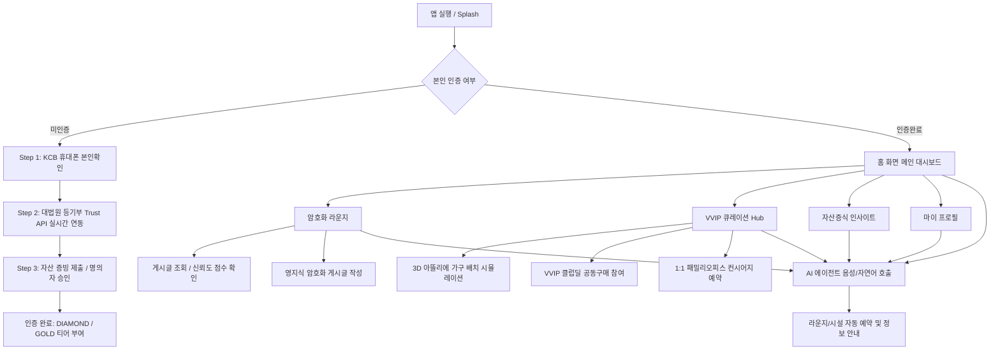

# 🏛️ ARATEL 정보 구조 (Information Architecture, IA) 정의서

> **서비스명**: ARATEL (아라텔) - 하이엔드 주거 커뮤니티 & VVIP 자산 플랫폼  
> **버전**: v1.0  
> **최종 수정일**: 2026-08-13  
> **상태**: Verified Production Architecture

---

## 1. 📌 서비스 아키텍처 개요

ARATEL은 하이엔드 아파트(디에이치 방배 등) 소유주 및 VVIP 자산가를 위한 폐쇄형 실소유주 인증 커뮤니티 및 프리미엄 라이프스타일 큐레이션 플랫폼입니다.

### 핵심 탭 구조 (Top-Level Bottom Navigation - 5 Tabs)

```
                       ┌───────────────────────────────────────────┐
                       │          ARATEL Mobile Application        │
                       └─────────────────────┬─────────────────────┘
                                             │
      ┌───────────────────┬──────────────────┼───────────────────┬───────────────────┐
      ▼                   ▼                  ▼                   ▼                   ▼
┌───────────┐       ┌───────────┐      ┌───────────┐       ┌───────────┐       ┌───────────┐
│ 1. 홈     │       │ 2. 라운지 │      │ 3. 큐레이션│       │ 4. 인사이트│       │ 5. 마이    │
│ (Home)    │       │ (Lounge)  │      │ (Curation)│       │ (Insights)│       │ (Profile) │
└───────────┘       └───────────┘      └───────────┘       └───────────┘       └───────────┘
                                             │
                                  [Floating AI Agent]
```

---

## 2. 🌳 상세 정보 구조 (IA Tree)

### 1.0 🏠 홈 (Home - `home_screen.dart`)
- **1.1 VVIP 소유주 헤더 카드**
  - 회원 이름 및 소속 단지/동호수 (`홍길동 님`, `디에이치 방배 101동 1502호`)
  - 티어 배지 (`DIAMOND TIER`) 및 검증 상태
- **1.2 웰컴 홈 대시보드**
  - **스마트 홈 원격 상태**: 조명, HVAC 냉난방 온도, 환기 제어 상태
  - **단지 주요 밸류 체인**: 자산 인증, 암호화 라운지, VVIP 큐레이션 숏컷
- **1.3 커뮤니티 & 가치 사슬 퀵 카드**
  - 3D 아뜰리에 평면도 시뮬레이션 연결
  - VVIP 클럽딜 최신 진행 현황
  - VIP 1:1 패밀리오피스 컨시어지 핫라인

---

### 2.0 💬 암호화 라운지 (Lounge - `lounge_screen.dart`)
- **2.1 카테고리 필터 바 (Sub-Tab Filter Pills)**
  - `전체 모아보기`: 전체 포스트 타임라인
  - `전체 공동`: 전국 하이엔드 단지 공통 토론
  - `단지 기명`: 실명/동호수 기반 입주민 게시판
  - `단지 익명`: 대법원 등기부 검증 익명 닉네임 게시판 (`은밀한 자산가 42`)
  - `VVIP 암호화`: DIAMOND 가중치 적용 영지식(Zero-Knowledge) 게시글
- **2.2 라운지 포스트 카드 (Post Card)**
  - 익명 닉네임, 검증 배지 (`VERIFIED_OWNER`), 티어, 단지명
  - 신뢰도 점수 지표 (`Trust Score: 98점`)
  - 암호화 본문 프리뷰 (AES-GCM 암호화 코드 블록 표현)
- **2.3 포스트 작성 워크플로우 (Post Creation Dialog)**
  - 제목 및 본문 입력
  - 영지식 세니타이징 및 신뢰 시그널 검증 후 즉시 발행

---

### 3.0 💎 VVIP 큐레이션 Hub (Curation - `curation_screen.dart`)
- **3.1 3D 아뜰리에 (`atelier_screen.dart`)**
  - 3D 평면도 뷰포트 (Draco 압축 GLB 가상 배치)
  - 수입 명품 가구 카탈로그 (B&B Italia, Minotti, Poliform 등)
  - 3D 커스텀 배치 시뮬레이션 저장 및 클럽딜 구매 혜택 연결
- **3.2 VVIP 클럽딜 (`club_deal_workflow.dart`)**
  - 단지 입주민 전용 하이엔드 공동구매 (하이앤드 가전, 미술품 등)
  - 달성 인원 및 할인율 진행률 스태퍼 (Linear Progress Bar)
  - 포인트 차감 및 최종 결제 워크플로우 모달
- **3.3 VIP 컨시어지 (`concierge_screen.dart`)**
  - WOORI TWO CHAIRS 패밀리오피스 자산관리 컨설팅 (1:1 세무/증여/외환)
  - 하이엔드 주거 방역, VIP 건강검진, 럭셔리 아트 도슨트 큐레이션
  - 1-Tap 희망일자 예약 신청 및 확정 대시보드

---

### 4.0 📊 자산증식 인사이트 (Insights - `insights_screen.dart`)
- **4.1 아실(ASIL) 빅데이터 리포트 헤더**
  - 해당 단지 실거래가 및 공급 물량 분석 요약
- **4.2 입주 물량 독성 지수 (Supply Gas Index Card)**
  - 향후 2년 입주 예정 물량 세대수
  - 위험도 레벨 배지 (`LOW`, `MEDIUM`, `HIGH`) 및 분석 요약
- **4.3 아실 층수별 실거래가 산점도 (Glow Scatter Plot)**
  - X축: 층수 (Floor), Y축: 거래가 (Price)
  - 애니메이션 펄싱 헤일로 및 파티클 링 인터랙티브 차트
- **4.4 최근 실거래 기록 리스트**
  - 층수, 거래 가격(억 단위), 계약일 정보 타임라인

---

### 5.0 👤 내 정보 & 자산 인증 (Profile - `profile_screen.dart`)
- **5.1 사용자 프로필 헤더**
  - 이름, 동호수 소속, 연락처
  - **자이로스코프 홀로그램 DIAMOND 배지**: 자이로/마우스 호버 반응 쉐이더
- **5.2 자산 인증 & 등기부 연동 센터 (`verification_screen.dart`)**
  - **보안 레이어 스위치**: 화면 캡처 방지 (`FLAG_SECURE`), PII 개인정보 마스킹
  - **3단계 인증 위저드**:
    - `Step 1`: KCB 휴대폰 본인확인
    - `Step 2`: 대법원 인터넷등기소 Trust API 연동 (라이브 3단계 스캔 레이저)
    - `Step 3`: VVIP 자산 증빙 서류 제출 & 가족/대리인 명의자 승인 위임

---

### 6.0 🤖 AI 에이전트 대화 오버레이 (Global Dynamic Overlay - `ai_agent_dialogue_overlay.dart`)
- **전역 FAB 클릭 또는 자연어 호출**
- 실시간 인터랙티브 음성 파형 비주얼라이저 (Audio Waveform)
- 1-Tap 추천 칩 (`라운지 조식 2명 예약`, `피트니스 혼잡도`, `사우나 이용 상태`)
- 커뮤니티/시설 예약 자동 실행 액션 (Action Dispatcher)

---

## 3. 🔄 주요 사용자 흐름 (User Flow Map)



---

## 4. 🔒 권한 및 데이터 등급 체계 (Data Security Hierarchy)

| 등급 | 접근 가능 영역 | 비고 |
|:---:|:---|:---|
| **PUBLIC** | 서비스 소개, 공지사항, 일반 인사이트 요약 | 미인증 사용자 |
| **VERIFIED OWNER** | 단지 기명/익명 게시판, 실거래가 산점도 상세 | 대법원 등기부 인증 완료 입주민 |
| **GOLD TIER** | VVIP 큐레이션 기본 혜택, 3D 아뜰리에 시뮬레이션 | 자산 증빙 10억 이상 소유주 |
| **DIAMOND VVIP** | VVIP 영지식 암호화 라운지, 클럽딜 최우선 참여, 1:1 패밀리오피스 | 자산 증빙 30억 이상 + 가중치 회원 |

---

## 5. 🗺️ 화면 네비게이션 라우팅 맵 (Route Index)

```
/
├── /home (홈 대시보드)
├── /lounge (암호화 라운지)
│   └── /lounge/create (게시글 작성 다이얼로그)
├── /curation (VVIP 큐레이션 Hub - Tab Controller)
│   ├── /curation/atelier (3D 평면도 아뜰리에)
│   ├── /curation/club_deal (VVIP 공동구매 클럽딜)
│   └── /curation/concierge (VIP 1:1 컨시어지)
├── /insights (아실 빅데이터 실거래 인사이트)
└── /profile (마이페이지 & 자산 인증)
    └── /profile/verification (3단계 등기부/자산 인증 센터)
```
